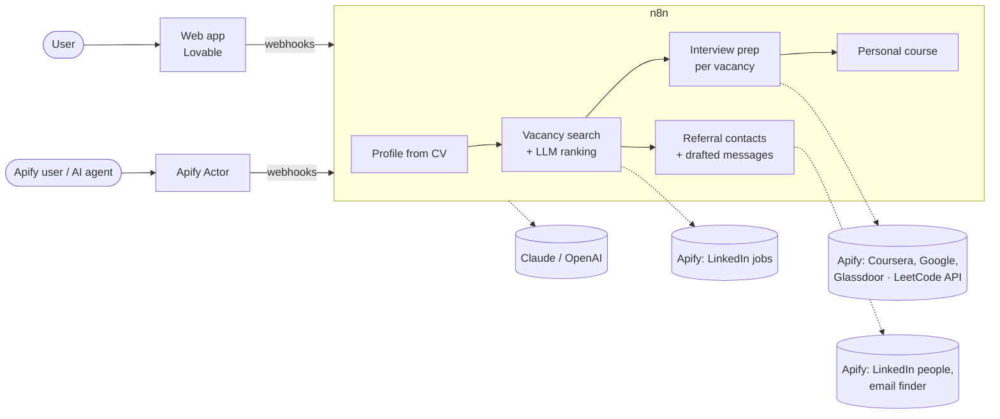

# Career Agent

An autonomous job-search agent. Upload your CV and target role, and it:

1. **finds matching vacancies** on LinkedIn and ranks them against your profile,
2. **builds a 14-day interview-prep plan** for each vacancy: skill gaps, Coursera courses, practice questions and LeetCode problems, and real interview reports from Glassdoor and the web,
3. **finds people who can refer you** at each company (fellow alumni, former colleagues, people on the same team) and drafts a short, personal message for each of them (never sent automatically),
4. **creates a personal learning course** from the skill gaps across all your vacancies, with progress tracking.

It re-checks for new vacancies every 2 hours and keeps your saved and hidden jobs.

- **Web app:** <add the published Lovable URL>
- **Apify Store:** [Career Agent Actor](https://apify.com/andrei_gruz/career-agent), the same agent for Apify users and AI agents (input: CV + role + city; output: dataset of vacancies with prep plans and referral contacts)

## Repository

| Folder | What it is |
|---|---|
| [`frontend/`](frontend/) | Web app built with Lovable (TanStack Start, React, TypeScript, Tailwind, Supabase auth) |
| [`n8n/`](n8n/) | Backend: n8n workflows (pipeline + API webhooks), with import instructions |
| [`apify-actor/`](apify-actor/) | Source of the published Apify Actor (Node.js, a thin client of the n8n webhooks) |
| [`docs/`](docs/) | [Architecture](docs/architecture.md), [webhook API](docs/api.md), [data tables](docs/data-tables.md) |

## How it works



The details (sequence, data tables, ids) are in [docs/architecture.md](docs/architecture.md).

## Run it yourself

1. **Backend:** follow [n8n/README.md](n8n/README.md): create the data tables, add Apify, Anthropic and OpenAI credentials, import the workflows, link the sub-workflows and publish them.
2. **Frontend:** create a Supabase project for sign-in, then:
   ```bash
   cd frontend
   cp .env.example .env   # fill in your Supabase project and n8n host
   bun install            # or npm install
   bun run dev            # or npm run dev
   ```
3. **Apify Actor (optional):** see [apify-actor/MANUAL_STEPS.md](apify-actor/MANUAL_STEPS.md); set `N8N_BASE_URL` to your n8n webhook URL.

## Data and privacy

No user data is in this repository. The live system stores CVs, profiles and publicly visible LinkedIn contacts in n8n data tables; referral messages are drafts that the user sends (or not) themselves. The webhooks identify users by their login id only, so add authentication before running this for real users.

## Team

<add names and roles>
