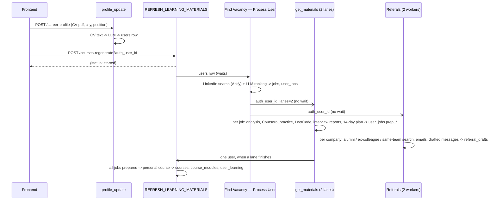
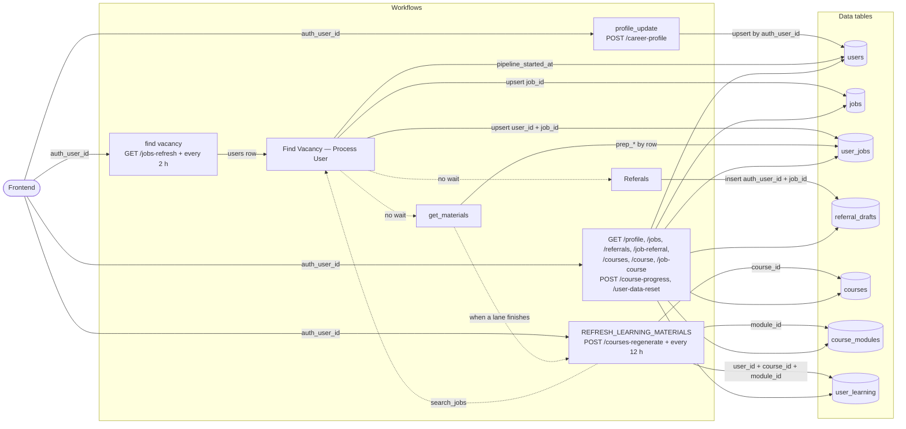

# Architecture

Career Agent has three parts:

- **Frontend** (`frontend/`, built with Lovable): sign-in (Supabase auth), profile + CV upload, vacancies, interview prep, referral contacts and learning courses.
- **Backend** (`n8n/`): n8n workflows. Webhooks serve the frontend; background workflows search jobs, build interview-prep plans, find referral contacts and generate courses. Data lives in n8n Data tables.
- **Apify Actor** (`apify-actor/`): the same agent as a public Apify Store Actor. It is a thin client that calls the n8n webhooks and returns the results as an Apify dataset.

External services: Apify actors for scraping (LinkedIn jobs, LinkedIn people search, Coursera, Google Search, Glassdoor interviews, email finder), the free LeetCode GraphQL API, and LLMs (Anthropic Claude, OpenAI) through n8n.

## Pipeline

1. `profile_update` extracts the CV text, an LLM turns it into a profile, and the `users` row is saved.
2. The frontend calls `POST /courses-regenerate?auth_user_id=`. It answers at once and starts the one-user path of `REFRESH_LEARNING_MATERIALS` in the background.
3. That path runs `Find Vacancy — Process User`: a LinkedIn job search per target role and location, an LLM that keeps the best matches, and a save to `jobs` and `user_jobs`. Jobs found again keep the user's choices (saved, hidden, status).
4. Process User starts `get_materials` and `Referals` in the background, at most once per 30 minutes per user (`users.pipeline_started_at`). Both only handle jobs that are not done yet.
5. When a `get_materials` lane finishes it asks for a course build. The course is built once every job has a prep plan, and only if something changed since `users.last_course_refresh_at`.
6. Schedules: `find vacancy` refreshes jobs for all users every 2 hours; courses for all users are rebuilt every 12 hours as a backstop.

## Connection graph

Boxes are workflows, cylinders are data tables; edge labels are the key used for the read or write.

## Ids

- `auth_user_id`: Supabase login id; every webhook takes it.
- `users.id`: internal user id, stored as text in `user_jobs.user_id` and `user_learning.user_id`.
- `job_id` = `linkedin:<external id>`.
- `course_id` = `course_<users.id>_<role slug>`; `module_id` = `course_id` + `_` + skill slug; `learning_id` = `learn_<users.id>_<module_id>`.

## Limits and known issues

- Webhooks trust the `auth_user_id` they receive (the frontend also sends the Supabase JWT, but most workflows do not verify it). Put authentication in front of them before real use.
- Apify allows 5 concurrent actor runs on the plan used: `get_materials` uses 2 lanes and `Referals` 2 workers, and every Apify call retries 5 times. Several users starting at the same moment can still hit the limit.
- The job search is tuned for the Netherlands (a country is added to every location).
- A course has at most 8 modules, so some jobs may have no module linked.
- Module ids come from the model's skill names, so a course rebuild can replace modules; progress stays on the old module.
